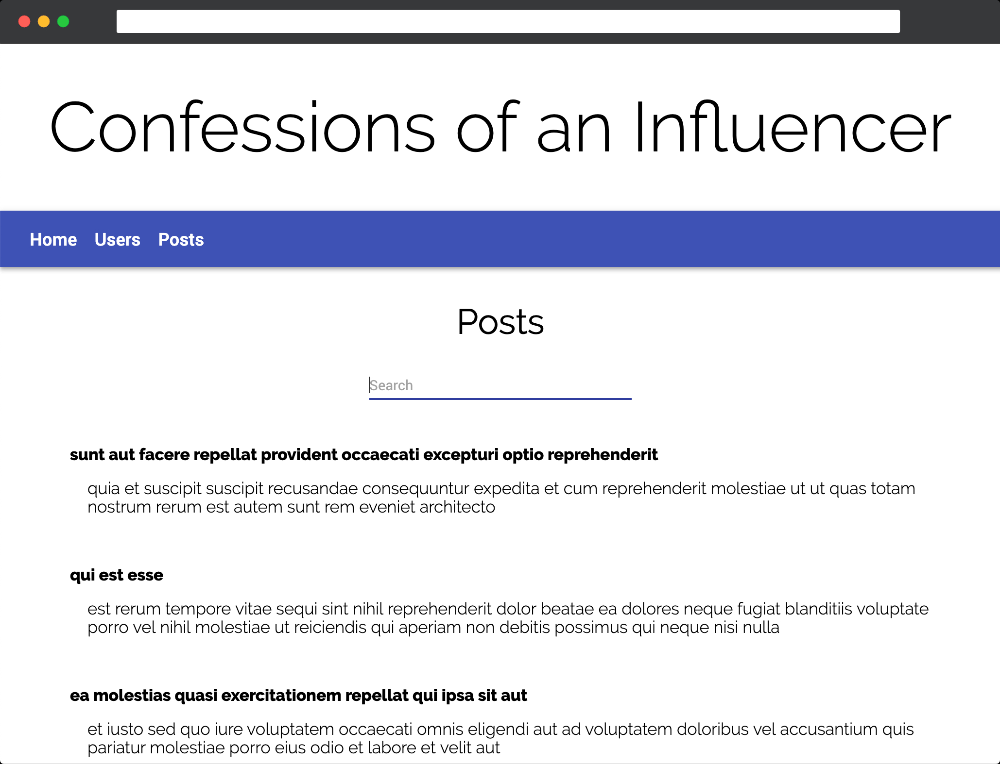

# Redux Blog
## By: Teonna, Sophie, & Kristin

This is a blog built using React with Redux and a bit of Material UI. The Home page displays the top 5 longest posts. If you switch to the Users tab, you can view a list of all users on the blog. If you click on a specific user, you can see their profile information along with a list of their posts. In the Posts tab, you view all the posts in a list, and filter through the posts by inputting a search term. If you click on a specific post, you can see that post's detail view, along with all the comments made on that post. 

### Run the Build
*npm run build*

### Start the App on Local Host
*npm run start*

